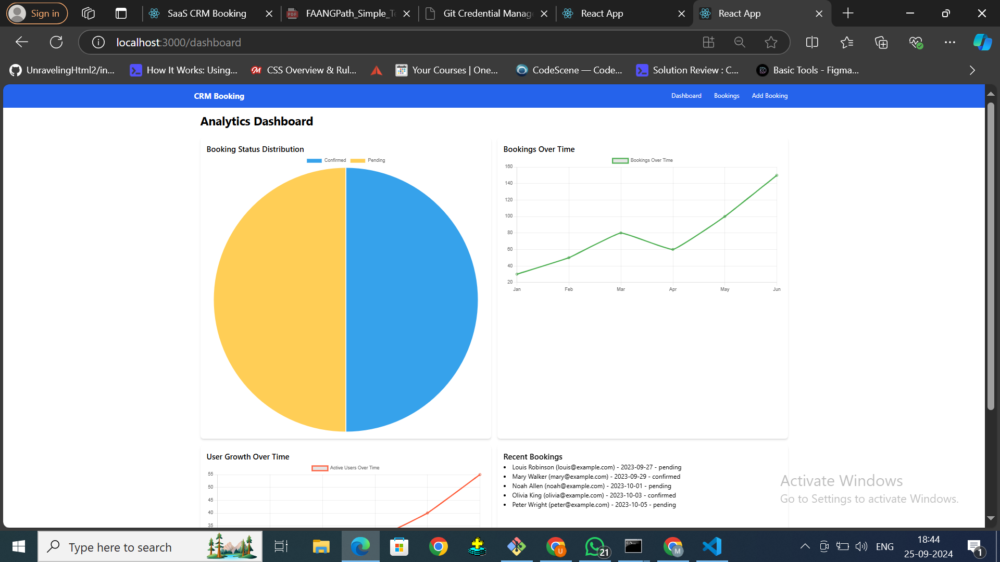
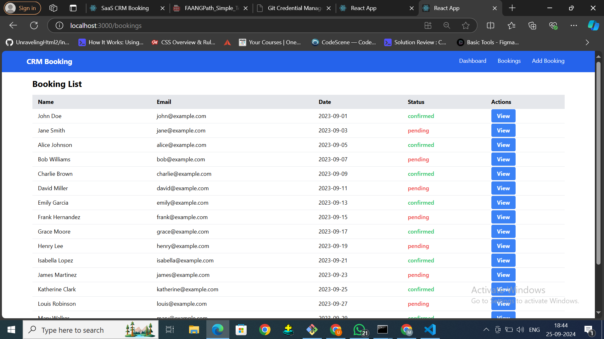
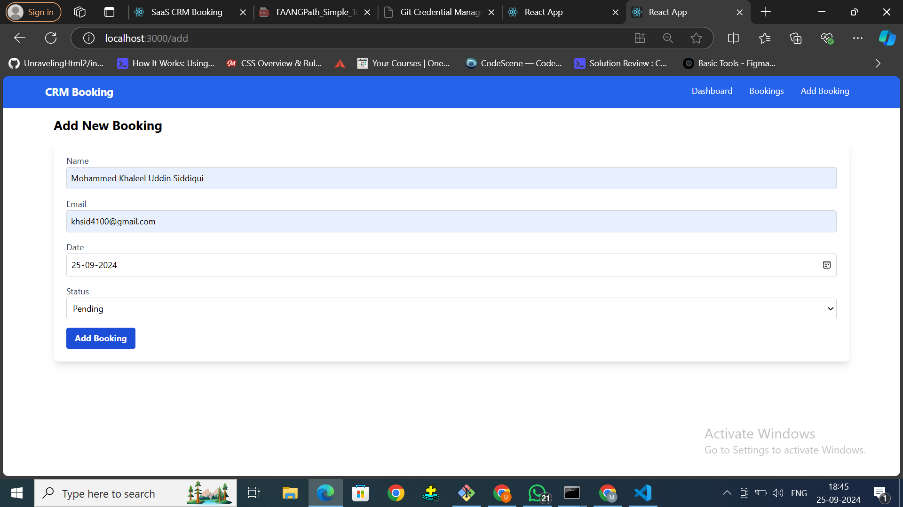

# SaaS Booking and CRM Solution

## Overview

This project is a SaaS-based solution that provides a comprehensive booking system integrated with Customer Relationship Management (CRM) functionalities. Designed for businesses in various sectors, such as healthcare, hospitality, and personal services, this solution streamlines the appointment scheduling process while enhancing customer relationships and data management.

## Features

- **Custom Sub-domain Booking Pages**: Each business can have its own sub-domain for bookings, making it easy for customers to access and schedule appointments.
  
- **CRM Functionalities**: Manage customer interactions, track preferences, and enhance relationships through personalized communication.

- **User Analytics**: Analyze booking patterns and customer behavior to make informed business decisions.

- **Automated Notifications**: Send reminders and confirmations via email and SMS to reduce no-shows and keep customers informed.

- **Responsive Design**: The application is built to be user-friendly on both desktop and mobile devices.

  ## Screenshots


*Dashboard showing upcoming bookings and analytics*


*Analytics section displaying customer booking patterns*


*Custom booking page for users*


## Technologies Used

- **Frontend**: React.js, HTML, CSS
- **Backend**: Node.js, Express.js
- **Authentication**: JSON Web Tokens (JWT)
- **Data Visualization**: Chart.js

## Installation

### Prerequisites

- React
- Node.js and npm


### Steps

1. Clone the repository:
   ```bash
   git clone https://github.com/khsid11/Saas.git
